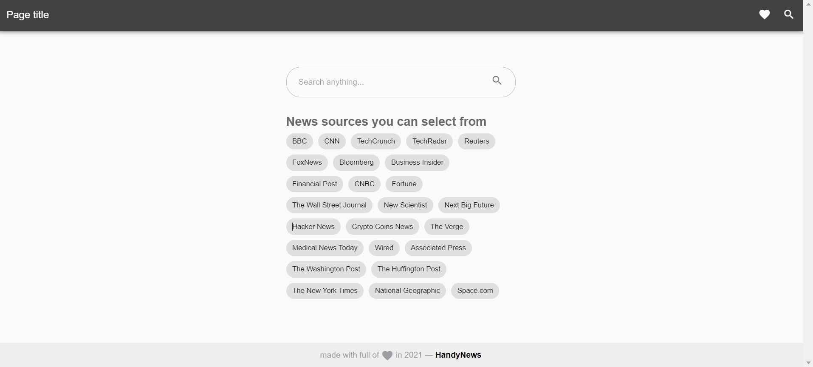
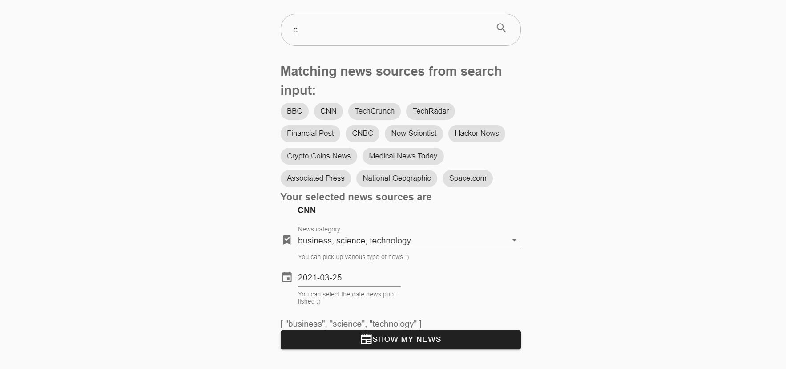

# Handy news :newspaper:

This is fun project for deepening the understanding of Vuejs 2.

It is news app shows fetches latest news from given news source.

## App screenshot

### Home page



This shows what are the news resource option we have. In search box, write and it will show the suggested news source.

### Select news category



After news resource selection, category should be selected. If it did not selected, it shows all category news.

### Result


This page shows the fetched news result from selected source on selected categories.

It gives brief information about what the news about including title, photo and short sentence for description.

It the fetched news not interested, it can be hidden or can be visited original weblink to read more about it in detail.
## Project setup
```
npm install
```

### Compiles and hot-reloads for development
```
npm run serve
```

### Compiles and minifies for production
```
npm run build
```

That's for simple introduction of this project. :smile: